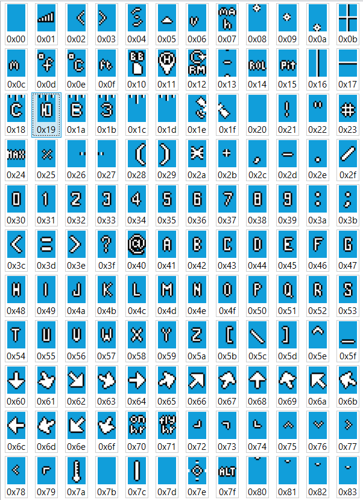

# Betaflight HAKRCF405V2 — кастомная прошивка с русским OSD

## 📌 Возможности
- Кастомный шрифт для OSD MAX7456 с поддержкой русских букв **С, В, Ю, З**.  
- Новый элемент **Numerical Heading** отображает сетку 3×5:
  С
З ↑ В
  Ю

- Под горизонтальной шкалой компаса появилась стрелка ↑ для удобного считывания курса.

- Совместимость: **MAX7456 OSD**.

---

## 📦 Содержимое
- `/firmware` — собранная прошивка (`.hex).  
- `/osd_fonts` — кастомный шрифт `default_rus.mcm` и превью-картинка.  
- `/patches` — diff-файлы с изменениями (для разработчиков).  
- `/docs` — инструкции и changelog.  

---

## 🚀 Установка
Полная инструкция: [INSTALL.md](docs/INSTALL.md)  

Кратко:
1. Прошейте `.hex` через **Betaflight Configurator** (*Firmware Flasher → Load Local Firmware*).  
2. В **OSD → Font Manager** загрузите `default_rus.mcm` и нажмите **Flash to OSD**.  
3. В *Configuration → Other Features → OSD* убедитесь, что выбран чип **MAX7456**.  
Команды для установки чипа:
set osd_displayport_device = MAX7456
save

---

## 📜 История изменений
Смотри [CHANGELOG.md](docs/CHANGELOG.md).

---

## 🤝 Участие
PR и предложения приветствуются.  
Если вы тестировали прошивку на других платах — напишите в Issues.  

---
