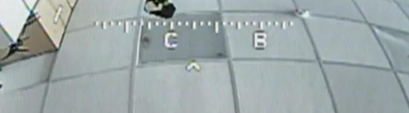

# Установка кастомной прошивки и шрифта

## 1. Прошивка
1. Скачайте `betaflight_HAKRCF405V2.hex` из папки `/firmware`.
2. Откройте **Betaflight Configurator** → *Firmware Flasher*.
3. Нажмите **Load Local Firmware** и выберите файл.
4. Прошейте полётный контроллер.

## 2. Шрифт
1. Перейдите в **OSD → Font Manager**.
2. Загрузите `default_rus.mcm` из папки `/osd_fonts`.
3. Нажмите **Flash to OSD**.
4. После прошивки выберите этот шрифт.

## 3. Важный параметр
В разделе **Configuration → Other Features → OSD** убедитесь, что выбран дисплейный чип: MAX7456

Команды для установки чипа:

set osd_displayport_device = MAX7456

save

Именно он используется для работы кастомного шрифта и новых OSD-элементов.

## 4. Новый OSD-компас
- Элемент **Numerical Heading** теперь отображает сетку 3×5:

- Под горизонтальной шкалой компаса отображается стрелка ↑.
